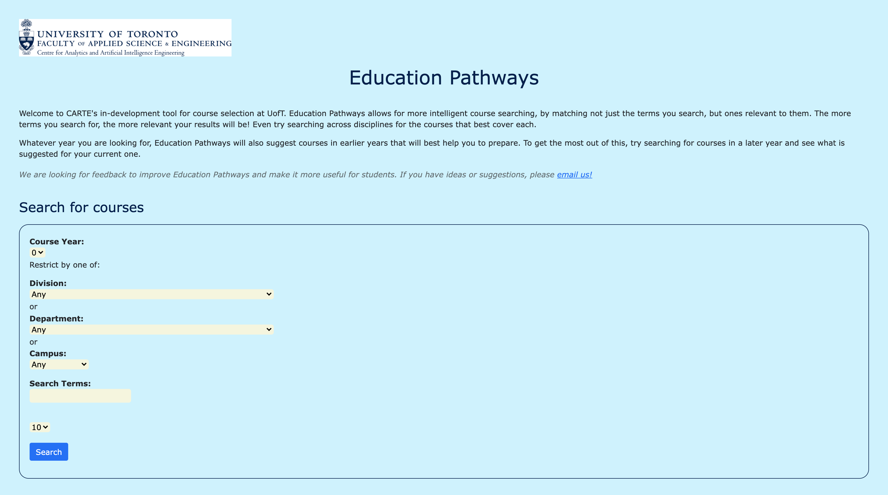
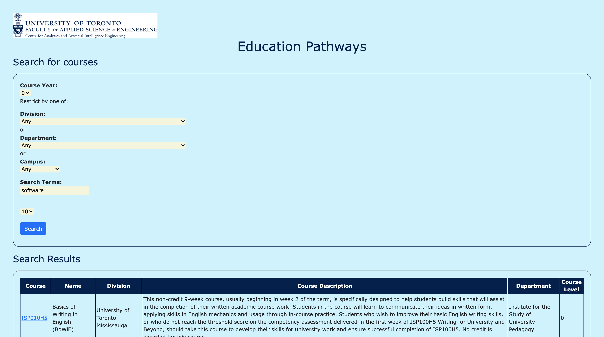
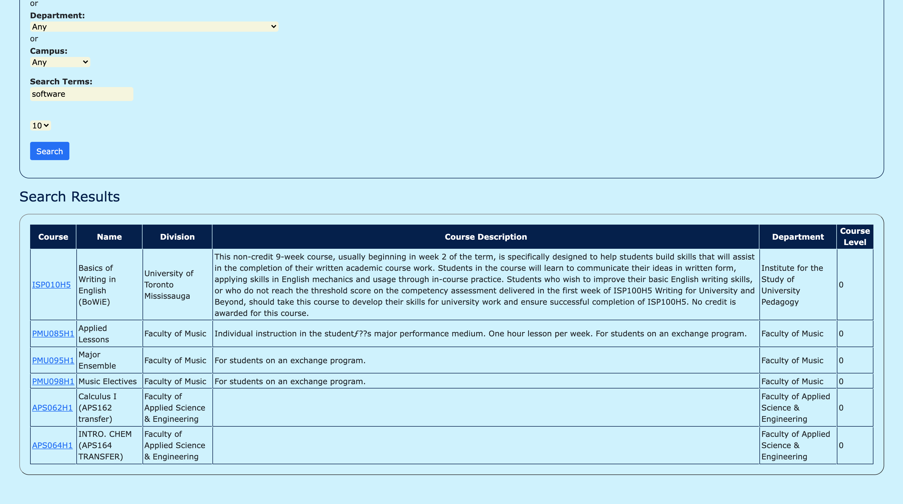
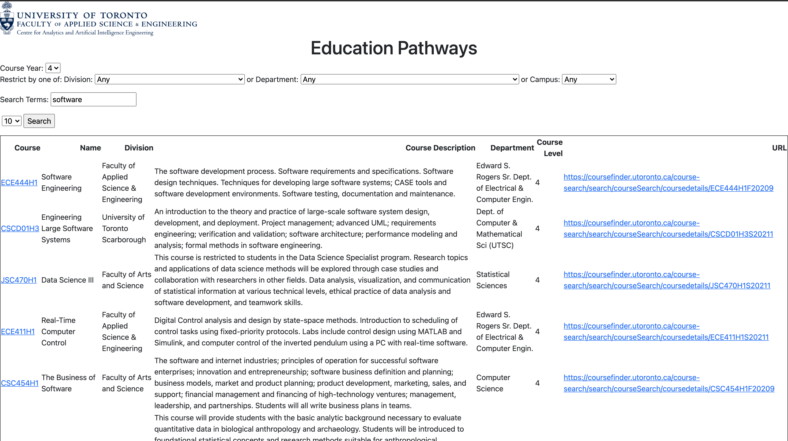

# ECE444-F2021-Lab5

This repo is a clone of https://github.com/nelaturuk/education_pathways.

## Submission

### Activity 1

### Activity 2-5

**Home Page**

**Results Page Form**

**Results Page Table**

### Activity 6

Compared to the old unstyled UI, the new UI uses styles to allow users to comfortably find the information they are looking for right away. The new UI uses different colours, borders, and overall styling to outline the things that matter. For example, the old table UI did not have any borders between columns/rows, did not have a common text alignment for table headers and data, and did not use different colours to make the table stick out.

The new UI addresses all of these issues, and allows users to spend less time figuring out where their required information is; giving them more time to actually processing the information they are searching for.

Here is the old results table compared to the new one:

**Old Results Tables**

**New Results Tables**

